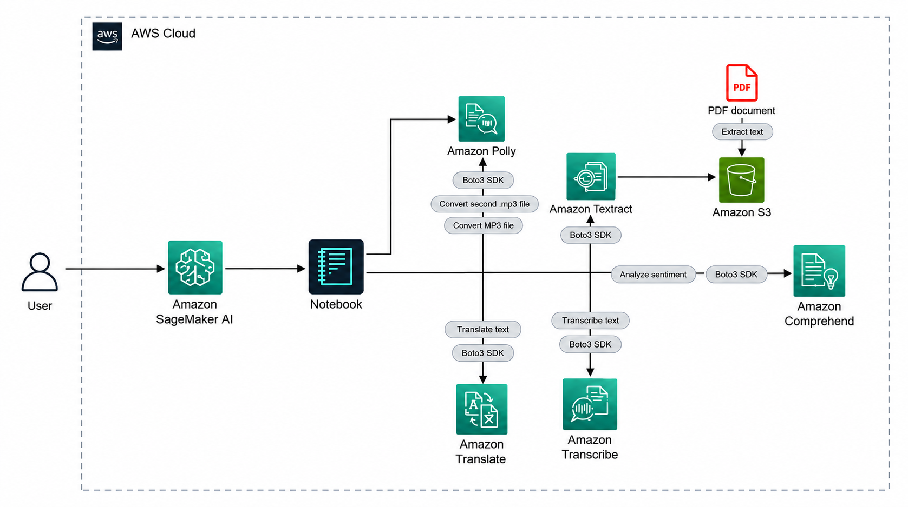

# AWS AI Document and Audio Pipeline

A Python and Boto3 learning project that connects managed AWS AI services into a document-to-audio workflow.

> Learning project inspired by AWS Skill Builder's **Use AI Services with Amazon SageMaker** practical. The code and documentation here are independently organized for a reusable portfolio repository. No AWS Skill Builder screenshots, lab instructions, credentials, or sample source documents are included.

## What it does

1. Reads a PDF stored in Amazon S3 and extracts its text with Amazon Textract.
2. Detects the sentiment of the extracted text with Amazon Comprehend.
3. Translates a text sample with Amazon Translate.
4. Synthesizes speech with Amazon Polly and saves the MP3 locally and to S3.
5. Starts an Amazon Transcribe job for the generated audio and retrieves the transcript.

## Architecture



[Open the scalable SVG diagram](screenshots/architecture.svg) · [Diagram source](scripts/build_architecture_diagram.py)

The diagram uses AWS's official architecture icons, embedded locally so it renders without loading external images. [AWS architecture icon guidance](https://aws.amazon.com/architecture/icons/).

## AWS services and SDK operations

| Service | Purpose | Boto3 operations |
|---|---|---|
| Amazon S3 | Store source PDFs and generated audio | `put_object` (the services read their S3 inputs) |
| Amazon Textract | Extract document text | `start_document_text_detection`, `get_document_text_detection` |
| Amazon Comprehend | Detect text sentiment | `detect_sentiment` |
| Amazon Translate | Translate extracted text | `translate_text` |
| Amazon Polly | Synthesize speech | `synthesize_speech` |
| Amazon Transcribe | Transcribe generated audio | `start_transcription_job`, `get_transcription_job` |

## Repository layout

```text
.
├── README.md
├── architecture.md
├── requirements.txt
├── .gitignore
├── scripts/
│   └── build_architecture_diagram.py
├── screenshots/
│   ├── architecture.png
│   ├── architecture.svg
│   └── aws-icons/
└── src/
    └── pipeline.py
```

## Prerequisites

- An AWS account or an authorized AWS training sandbox.
- Python 3.10 or newer.
- AWS credentials configured through an IAM role (recommended in SageMaker) or a local AWS profile.
- An S3 bucket in the selected AWS Region, with a PDF uploaded to it.
- IAM permissions scoped to the bucket and the required Textract, Comprehend, Translate, Polly, and Transcribe operations.

Do not put access keys in this repository or notebook. In SageMaker, use the notebook's execution role. Locally, use an AWS profile or another supported credential provider.

## Setup

Create and activate a virtual environment, then install dependencies:

```powershell
py -m venv .venv
.venv\Scripts\Activate.ps1
python -m pip install -r requirements.txt
```

Set the configuration in your shell (replace the sample values):

```powershell
$env:AWS_REGION = "us-east-1"
$env:AWS_BUCKET = "your-unique-bucket-name"
$env:AWS_INPUT_KEY = "input/your-document.pdf"
$env:AWS_OUTPUT_PREFIX = "pipeline-output"
```

Run the pipeline:

```powershell
python -m src.pipeline
```

The script reports extracted text, sentiment, a translation, the S3 location of the generated MP3, and the transcription. Generated audio is also saved under `output/` locally.

## Important implementation notes

- Textract's asynchronous document-text workflow is used so multipage PDFs can be handled. The input PDF must be in S3.
- Transcribe is asynchronous; the example polls for job completion and uses a unique job name per run.
- This is a demonstration, not a production document-processing service. Add input validation, retries, structured logging, privacy controls, and workflow orchestration before production use.
- The notebook and script make billable AWS API calls. Check current pricing, configure a budget, and remove unneeded S3 objects after testing.
- Do not upload confidential or personally identifiable documents to a learning account.

## Learning outcomes

- Use Boto3 clients to call multiple AWS service APIs.
- Pass outputs between document, language, speech, and transcription services.
- Understand asynchronous AWS jobs and S3-based service inputs/outputs.
- Apply IAM least privilege and keep AWS credentials out of source control.

## License

No license is specified. Add a license only after choosing how you want others to be allowed to reuse this project. AWS services and Boto3 remain subject to their respective AWS terms.
